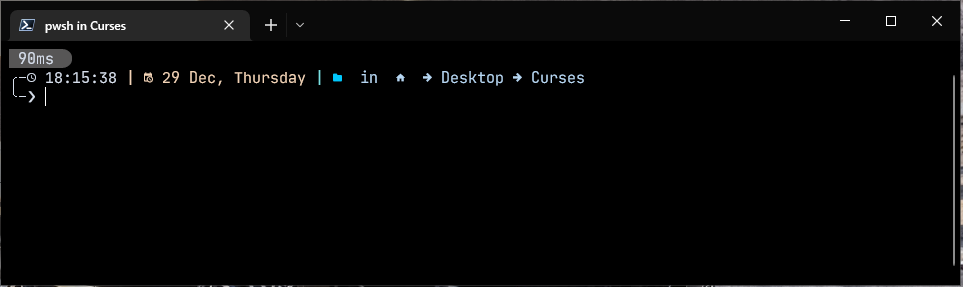
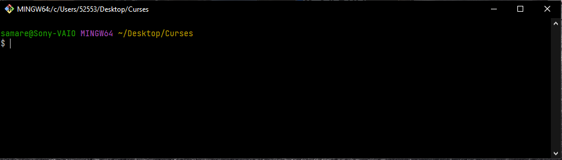

# Consideraciones iniciales 🤓

Como todo buen programador, lo primero es manejar las herramientas esenciales para llevar a cabo tus proyectos. Una de estas herramientas es sin duda: la terminal. Al principio puede parecer intimidante, pero no es así. La terminal es una herramienta que te permitirá interactuar con el sistema operativo y otros programas en tu equipo. En la terminal podrás ejecutar comandos, ver información de tu sistema y mucho más. Existen diversos comandos y herramientas de la terminal que te permitirán interactuar con GIT y el repositorio de tu proyecto. A continuación se enlistan algunos de los comandos básicos que utilizarás (y que con el tiempo y práctica dominarás) durante tu interacción con GIT.<br>


## **Comandos básicos de la terminal 📟**

Independientemente del Sistema Operativo (SO) en que te encuentres, como desarrollador debes tener un dominio aceptable del uso de la "**terminal**"/"**línea de comandos**". Existen diversas versiones/tipos de "línea de comandos", que puede depender del SO en el que te encuentres. Pero la gran mayoría contempla el uso de somandos estándarizados. En caso de que en la terminal que estés trabajando no se ejecute una intrucción o te marque un error, es recomendable acceder a la documentación oficial y buscar el comando equivalente para ejecutar correctamente una instrucción.  

Si abres tu terminal desde el menú búsqueda o de programas de tu equipo, es importante que consideres que por lo general, el directorio por defecto es el usuario actual, por ejemplo, en Windows, después de abrir la terminal desde el menu de programas, podrás ver algo como esto:  
```powershell
Microsoft Windows [Versión 10.0.19045.2364]
(c) Microsoft Corporation. Todos los derechos reservados.

C:\Users\YourUserName>
```
Para el caso de GitBash (terminal que puedes agregar al instalar Git en tu equipo) podráss ver algo cómo esto:
```poweshell
pcName@Sony-VAIO MINGW64 ~
$
```
Es importante tener en cuenta que al momento de ejecutar uno o más instrucciones en la termial, estos afectarán directamente al directorio (y sus archivos) en donde ***ésta*** haya sido posicionada (a excepción de los comandos para la gestión del sistema), es decir, si abres la terminal desde el menú de programas, afectará a las carpetas, subcarpetas contenidas dentro del usuario actual. Ahora bien, al crear un proyecto, generalmente lo hacemos dentro de una carpeta (también llamado *directorio*) el cual contendrá todos los archivos necesarios para trabajar en el proyecto que queramos, entonces para que podamos implementar los comandos de la terminal sobre nuestros archivos, es necesario que la terminal "esté" posicionada en el directorio que contiene nuestro proyecto.  

Por ejemplo, si creas la carpeta `Curses` en el *Escritorio*, es necesario que la terminal esté posicionada/direccionada en esta carpeta. Esto también se conoce como "***ruta del directorio***", para ello hay diversas maneras de abrir una terminal y posicionada en nuestro directorio de trabajo.  

Generalmente, abrir la terminal en una carpeta específica puede hacerse con "*click*" derecho del *mouse* sobre la capeta en cuestión y en el menú desplegable que aparece, basta con seleccionar "**Abrir en terminal**" o para el caso de tener instalado GitBash, la opción a elegir puede ser "**GitBash here**". Esto abrirá la terminal seleccionada y ya "***posicionada***" en la carpeta seleccionada.  

Para el caso de haber elegido "**Abrir en terminal**", podrás ver algo como esto:

*Nota*: Esta configuración de interfaz se logra mediante la implementación de [Oh My Posh](https://ohmyposh.dev/). Video tutorial [aquí](https://www.youtube.com/watch?v=d9y0l7yY404)  

Para el ejemplo de GitBash, podrás ver algo como esto:
  

Existen otras maneras de posicionar la terminal en tu carpeta de trabajo (con el uso de la terminal por supuesto), pero ésta es la más accesible. Si observas las imágenes, notarás que ambos ejemplos indican que la terminal está posicionada enla carpeta/directorio `Curses`, que a su vez está dentro de `Desktop`, con esto nos aseguramos que los comandos ejecutados dentro de la terminal con esta configuración afectarán a la carpeta `Curses` y a las sub carpetas y archivos dentro de ella que se encuentran en ***primer nivel***.  

Pero, ¿que quiere decir ***primer nivel***? Bueno, siguiendo con el ejemplo anterior, vamos a suponer que dentro de `Curses`, creamos la carpeta `images` y la carpeta `videos`, cada una con sus respectivos archivos (y carpetas si es requerido), entonces como nuestra terminal está posicionada en la carpeta `Curses`, sólo podremos manipular los archivos y carpetas *directos* en el "**primer nivel**", pero no podremos manipular los archivos (y carpetas si es el caso) contenidos dentro de las carpetas `images` o `videos`, entonces, para poder realizar las acciones necesarias sobre los archivos contenidos dentro de estas dos últimas carpetas, es necesario "*navegar*" y posicionar la terminal en estos directorios, ya sea `images` o `videos` según se requiera.  

La "*navegación*" entre carpetas es sencilla, el comando para este cometido es `cd` adicional al nombre de la carpeta deseada o en su defecto `..` para "*salirse un nivel*" de la carpeta actual y posicionarse en la carpeta de nivel *superior*.

La tabla siguiente enlista los comandos esenciales más utilizados en el manejo de archivos.

Comando | Utilidad
--- | ---
`ls` | Listar los archivos y carpetas que componen el directorio actual
`ls -a` | Listar *todos* los archivos y carpetas que componen el directorio actual, incluyendo  los archivos *ocultos*.
`pwd` | Conocer la ruta completa de la carpeta/directorio en la que te encuentras actualmente.
`cd <directoryToMove>` | Moverte a un direcorio/carpeta específica dentro de tu directorio actual.
`cd ..` | Regresar "*una posición*" hacia atrás (también conocido como *subir un nivel*) a partir del directorio en el que te encuentras actualmente.
`mkdir <directoryName>` | Creación de un directorio/carpeta dentro de tu posición actual.
`touch <fileName.ext>` | Creación de un archivo con el nombre y extensión especificados en el directorio/carpeta actual.
`mv <oldFileName.ext> <newFileName.ext>` | Comando para modificar/cambiar/actualizar un nombre de un archivo a otro.
`rm <fileName.ext>` | Comando para eliminar un archivo que se encuentra dentro de tu directorio actual.
`rm -r <directoryName>` | Comando para eliminar un archivo que se encuentra dentro de tu directorio actual.
`clear` | Comando para limpiar la pantalla de tu terminal. En algunas terminales se utiliza `cls`.
`git <comand> -h` | Comando para ver las "opciones" de configuración del comando Git definido en "`<comand>`".

Existen toda una gama de comandos en el uso de la terminal, conforme la utilización de los comandos vaya siendo más requerida, esta tabla se irá actualizando para enriquecer esta información.